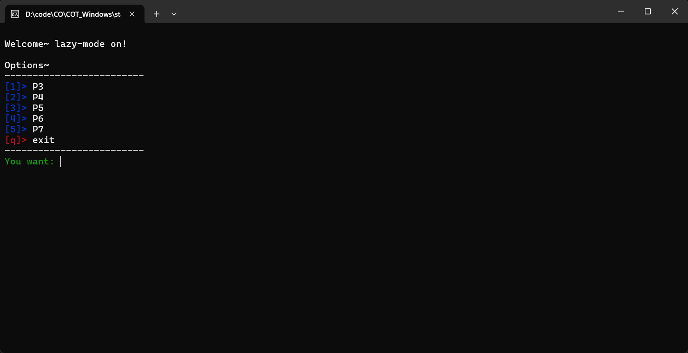
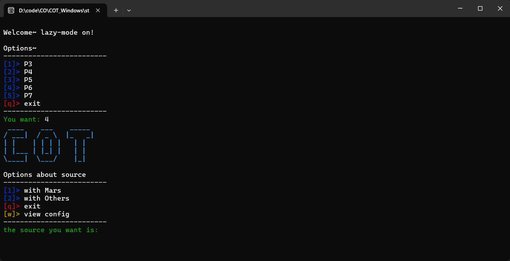
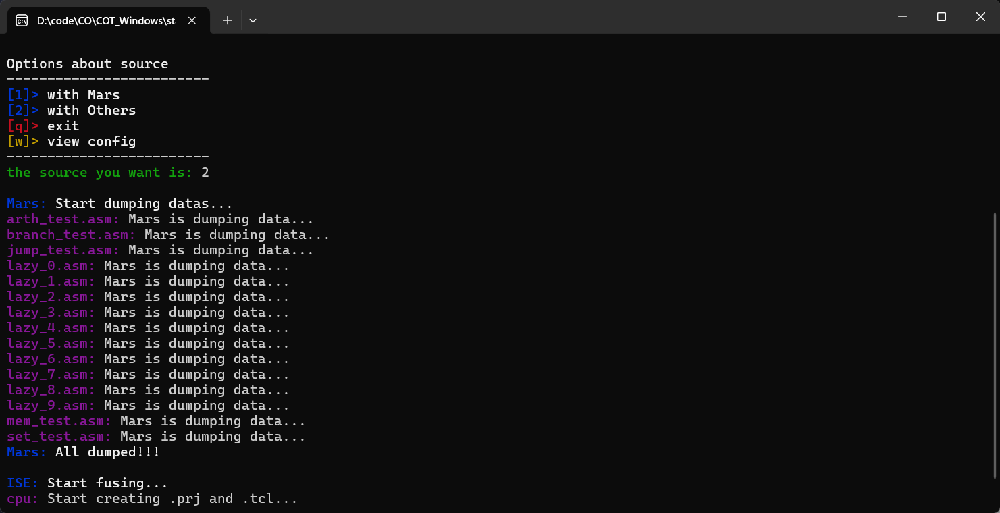
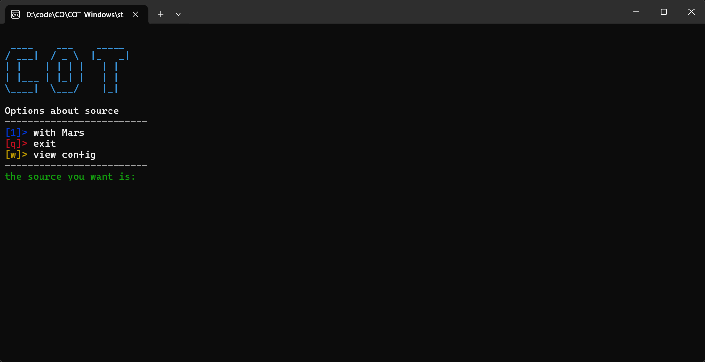
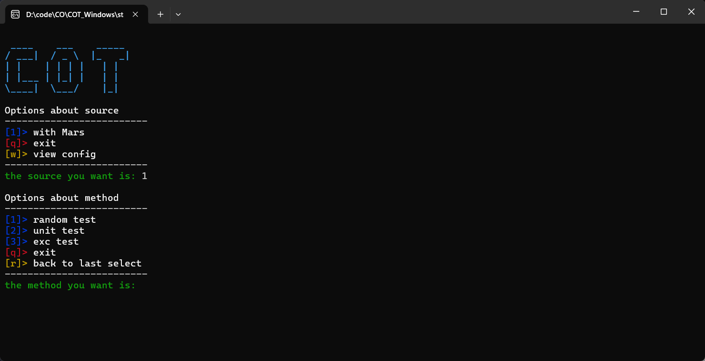
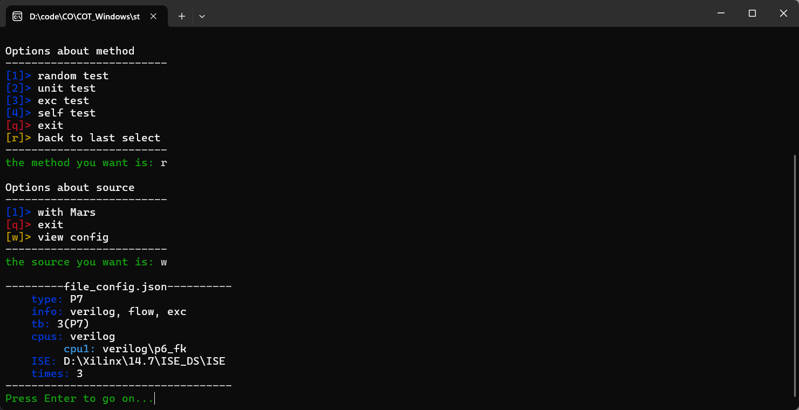

# COT使用指南
[toc]

## 运行与使用
```py
pip install -r requirements
```
- 如果为Windows系统，无法安装`curses`可以安装`windows-curses`
```py
pip install blessed
pip install windows-curses
```

## 云盘链接(有bug版本)
https://bhpan.buaa.edu.cn/link/AAD1541E4EDC8549DC9C3823DBA5A5A572

## <font color = red> 快速开始 </font>
1. 根据你的操作系统选择相应的测评机，目前支持Windows，Linux版本
   - `COT_Windows`
   - `COT_Linux`

2. 在任意目录下解压，双击`start.exe`/`start`开启测评机
   - 报错`ERROR: No file can be used in .\configs`,安装正常，接下来配置测评机环境

3. 快速开始测评请直接看[懒惰模式](#lazy)


---
## 模式
### `lazy`

1. 在目录`configs`下新建`file_config.json`
   - 写入内容为
      ```json
        {
          "lazy-mode": true
        }
      ```
    - 相关参数参考
      - [lazy-mode](#lazy-mode)
2. (非必要)当前情况下测评机将自动查询**ISE路径**(如果使用`verilog-CPU`)与**测评CPU路径**(`verilog-CPU/logisim-CPU`)，如果目前电脑文件繁杂，可能耗时较长，此处可以手动设置
   - 明确你的测试内容(`P3~P7`)
   - 例如在目录`configs`下新建`__default_p3.json`
   - 写入内容为 
    ```json
      {
        "xilinx_path": "ISE路径", 
        //测评verilog-CPU
        "verilog_dir": "verilog-CPU路径",
        //或者测评logisim-CPU
        "circ_dir": "logisim-CPU路径",
      }
    ```
   - 相关参数参考
     - [xilinx_path](#xilinx_path)
     - [verilog_dir](#verilog_dir)
     - [circ_dir](#circ_dir)
    
3. 重新启动测评机，将可以正常开始测评，如果有报错，请根据测评机的报错进行调整
   - 进入如下模式，证明测评机配置完成，可以选择自己需要测评的内容了
   

4. 选择对拍的对象
   
   - `with Mars`: [与Mars对拍](#with-mars)
   - `with Others`: [与同学CPU对拍](#with-others)
   - `exit`: [退出测评机](#exit)
   - `view config`: [检查目前测评机识别的配置](#view-config)


5. 等待测评
   
6. 如果有错误将获得debug文件夹

---
### `norm`
1. 提供更多自定义操作，配置较为复杂，下方所有参数必须包含在配置文件中，否则一定**无法启动**测评机
   - 更多配置参考
     - [配置](#配置)
     - [配置参数解释](#配置详细介绍)
    ```json
      //不写lazy-mode也默认不进入懒惰模式
      //"lazy-mode": false,

      //需要使用的测评机版本"logisim"、"verilog"
      "type": "verilog",

      //0 -> 不需要测评机为你添加tb文件，请你已经有tb文件命名为mips_tb
      //1 -> 正常tb文件，可以在util文件夹下查看内容或者更改，可以在P4、P5使用
      //2 -> 官方tb文件，课程组提供的接口，可以在P6使用
      //3 -> 官方tb文件，课程组提供的接口，可以在P7使用
      "tb": 3,

      //是否是流水线CPU，意味着支持logisim-flow
      "flow": true,

      //是否支持中断异常
      "exc": true,

      //你的ISE路径
      "xilinx_path": "D:\\Xilinx\\14.7\\ISE_DS\\ISE",

      //logisimCPU文件存放文件夹
      "circ_dir": "circ",

      //verilogCPU文件存放文件夹
      "verilog_dir": "verilog",

      //你希望测评机测试的指令集，下面已经是目前能够提供的最大指令集
      //不用包含和异常相关指令，但是进行异常测试前请确保你实现了以下指令
      //mtc0, mfc0, eret, syscall
      "mips_set": ["add", "sub", "and", "or", "slt", "sltu", "ori", "addi", "andi", "lui", "sw", "sb", "sh", "lw", "lb", "lh","beq",
          "bne","mult", "multu", "div", "divu", "mfhi", "mflo", "mthi", "mtlo", "jal", "jr", "nop"],

      //设置为正数且为整数，指定为random测试的生成的测试数量
      "test_times": 3
 
    ```
2. 启动测评机
   
3. 选择对拍对象
     - 如果未发生错误，将会进入如下页面，否则请根据测评机报错更改
     
       - `with Mars`: 与Mars对拍
       - `with Others`: 与同学CPU对拍，同上
       - `exit`: 退出测评机
       - `view config`: [查看当前配置](#view-config)
4. 选择测试类型
     - 测评机提供多种测试类型
      
      - `random`: [随机化指令测试](#random-test)
      - `unit`: [指令的功能测试](#unit-test)
      - `exc`: [异常测试](#exc-test)
      - `int`: [中断测试](#int-test)
      - `self`: [DIY测试](#self-test)
      - `exit`: [退出测评机](#exit)
      - `r`: [返回上一条选择](#return-last-select)  
5. 等待测评，错误返回debug文件夹
---
## 配置
- **懒惰模式下不需要除`lazy-mode`外任何其他配置！！！**
- 在使用本测评机前请保证你已经修改了相应的参数
- 命名规范
  - 测评机器**默认读取**`file_config.json`
  - 如没有，测评机只读取**第一个文件配置**
  - 请不要将配置命名以`__`开头
- 测评机会**自动提示你补全需要的所有的参数**
- 如下是所有配置最完整的文件示例，各参数含义请看[配置含义](#配置详细介绍)
  ```json
    "lazy-mode": false,

    "type": "verilog",

    "tb": 2,

    "flow": true,

    "exc": true,

    "xilinx_path": "D:\\Xilinx\\14.7\\ISE_DS\\ISE",

    "circ_dir": "circ",

    "verilog_dir": "verilog",

    "self_util": "util\\testcodeplus.exe",

    "self_dir": "self",

    "mips_set": ["add", "sub", "and", "or", "slt", "sltu", "ori", "addi", "andi", "lui", "sw", "sb", "sh", "lw", "lb", "lh","beq",
        "bne","mult", "multu", "div", "divu", "mfhi", "mflo", "mthi", "mtlo", "jal", "jr", "nop"]
    
    "test_times": 3
  ```

---
## 配置详细介绍
### `lazy-mode`
- 懒惰模式详细介绍
  - `true`: 开始懒惰模式，不会读取**其他任何配置**
  - `false`: 关闭懒惰模式
  - `无此配置`: 默认关闭懒惰模式

### `type`
- CPU实现语言详细介绍
  - `logisim`: `P3`
  - `verilog`: `P4~P7`

### `tb`
- 测评机添加testbench详细介绍
  - `0`: 不需要测评机为你添加tb文件，请确保为mips_tb
  - `1`: `util\mips_tb_1.v` 正常tb文件，可以在util文件夹下查看内容或者更改，可以在P4、P5使用
  - `2`: `util\mips_tb_2.v` 官方tb文件，课程组提供的接口，可以在P6使用
  - `3`: `util\mips_tb_3.v` 官方tb文件，课程组提供的接口，可以在P7使用(仅仅内部异常)

### `flow`
- 实现CPU类型@1详细介绍
  - `true`: 流水线CPU
  - `false`: 单周期CPU
- 相关参数参考
  - [random test](#random-test)

### `exc`
- 实现CPU类型@2详细介绍
  - `true`: 支持异常中断的CPU
  - `false`: 不支持异常中断的CPU
- 相关参数参考
  - [exc test](#exc-test)
  - [int test](#int-test)
  - [random test](#random-test)

### `xilinx_path`
- ISE路径详细介绍
  - `str字符串`: ISE的路径
  - eg.`"D:\\Xilinx\\14.7\\ISE_DS\\ISE"`
  - eg.`"/opt/Xilinx/14.7/ISE_DS/ISE"`
  - eg.`"/mnt/d/Xilinx/14.7/ISE_DS/ISE"`

### `circ_dir`
- `logisim-CPU`路径详细介绍
  - `str字符串`: CPU的路径
  - 标准格式
    ```
    |- circ
      |- a.circ
      |- b.circ
      |- ...
    ```
  - 默认存放需要对拍的`.circ`程序
    - **测评机不会对此文件夹内的文件进行更改，请放心使用**
    - 与`Mars`对拍中，会将此文件夹下所有文件都与`Mars`对拍
    - 同理，该文件夹下可以放置需要互相对拍的程序
  - `无此配置`: `type不是logisim`否则报错

### `verilog_dir`
- `verilog-CPU`路径详细介绍
  - 测评机以`mips.v`标识一个CPU，同目录下所有的`.v`文件都将被标识为一个CPU（不包含子目录中的`.v`文件）
  - `str字符串`: CPU的路径
  - 标准格式
    ```
    |- verilog
      |- cpu1
        |- mips.v
        |- ...
      |- cpu2
      |- cpu3
      |- ...
    ```
  - 默认存放需要对怕的`.v`项目
    - **无需进行清洗，可以直接将ISE项目复制过来，测评机会自动选出所有的CPU文件**，嫌麻烦甚至可以链接到你的ISE项目作为测评文件夹，**测评机不会对此文件夹内的文件进行更改，请放心使用**
    - 与`mars`对拍时，文件夹下的每一个识别到的CPU作为一个CPU项目测评
    - 相互对拍也同理
  - `无此配置`: `type不是logisim`否则报错


### `self_util`
- DIY数据生成器介绍
  - `str字符串`: 数据生成器路径
  - **Attention**: 如果你希望加载数据生成器请确保它是`exe` `jar` `py`中的一种，如果是`jar`或者`py`请确保你已经有`java`或者`python`环境变量
    运行程序直接输出你构造的数据
    ```py
      # 构造数据
      for mips in mips_code:
        ...
        print(mips)
    ```
    ```c
      char mips[400][40] = {0};
      //你的数据生成逻辑
      for(int i = 0; i < 400; i++) {
        printf("%s\n", mips[i]);
      }
    ```
  - `无此配置`: 可能对self_test有一定影响
- 相关参数参考
  - [self test](#self-test)

### `self_dir`
- DIY数据测试点介绍
  - `str字符串`: 测试点集的路径
  - 可以加载三种，无异常中断的asm程序、16进制码txt文件、针对异常中断的文件夹测试点
  - **Attention**：关于测试点的加载测试，主要针对异常与中断测试，需要遵循如下规则
    - 若只包含一个asm源码，请包含异常处理程序在内（**请以nop的方式填补空缺，而非.ktext**）
    - 可以将测试代码与异常处理程序分开，异常处理程序请包含关键词**handler**
    - 可以不包含tb，如果想要用tb进行中断测试请加入.v文件，命名无要求
    ```
      |- self
        |- testcode1
          |- a.asm
          |- the_handler.asm
          |- mytb.v
        |- btest.asm
        |- code.txt
        |- ...
    ```
  - `无此配置`: 可能对self_test有一定影响
- 相关参数参考
  - [self test](#self-test)

### `mips_set`
- 测试指令集详细介绍
- `list列表`: 需要测试的所有指令集合
- 目前最大支持 ["add", "sub", "and", "or", "slt", "sltu", "ori", "addi", "andi", "lui", "sw", "sb", "sh", "lw", "lb", "lh","beq","bne","mult", "multu", "div", "divu", "mfhi", "mflo", "mthi", "mtlo", "jal", "jr", "nop"]
- 不需要加入与异常相关指令

### `test_times`
- 测试点数目详细介绍
- `int数字`: 控制random测试和self测试测试点数目
- 相关参数参考
  - [random test](#random-test)
  - [self test](#self-test)

---
## 功能详细介绍
### `with Mars`
- 将CPU路径下所有CPU都与Mars对拍，得到测评结果

### `with Others`
- 将CPU路径下所有CPU相互对拍，得到测评结果
- <font color=red>如果识别的CPU路径中CPU数量少于两个，将不会出现`with Others`选项</font>

### `exit`
- 退出测评机

### `return last select`
- 从测试类型选择返回对拍对象选择

### `view config`
- 显示当前测评机配置
  
  - `type`: 测试类型
    - `P3/P4/P5/P6/P7`：代表标准测试内容
    - `??`：非标准测试内容，例如不使用测评机提供tb文件、logisim流水线cpu等等，会提示Warning
    - `XX`：错误测试类型，你填写的内容之间矛盾，测评机提示你更改
  - `info`: 测试信息，包含实现CPU语言、是否流水线、是否支持异常
    - `verilog/logisim`
    - `flow/single`
    - `exc/simple`
  - `tb`: 使用tb文件类型
    - `0(not used)`
    - `1(P4/P5)`
    - `2(P6)`
    - `3(P7)`
  - `cpus`: 显示设置的CPU目录以及识别到的所有CPU
  - `ISE`: 当前ISE路径
  - `test_times`: random测试/self测试生成测试点个数
- 相关参数参考
  - [所有配置详细介绍](#配置详细介绍)

### `unit test`
- 出现条件: 无
- 推荐测试: `P3~P6`
- 功能亮点: 对CPU指令进行功能测试，即验证数据通路是否有问题
- 测试数量: **测试点数目不受`test_times`影响，是固定的**
- **注意事项**: 不对与异常相关指令测试

### `exc test`
- 出现条件: `exc: true`
- 推荐测试: `P7`
- 功能亮点: 对CPU内部异常实现测试
- 测试数量: **测试点数目不受`test_times`影响，是固定的**
- **注意事项**: 异常指令功能、转发、暂停等有弱测试
- 相关参数参考
  - [exc](#exc)


### `int test`
- 出现条件: `exc: true`且对拍对象**不为Mars**
- 推荐测试: `P7`
- 功能亮点: 对CPU外部中断实现测试
- 测试数量: **测试点数目不受`test_times`影响，是固定的**
- **注意事项**: 异常指令功能、转发、暂停等有弱测试；中断实现方案为testbench或者计时器(计时器采取0模式)
- 相关参数参考
  - [exc](#exc)

### `random test`
- 出现条件: 无
- 推荐测试: `P3~P7`
- 功能亮点: 针对不同配置生成不同随机测试点，弱功能测试、暂停和转发(`flow: true`)、异常和中断(`exc: true`)
- 测试数量: **测试点数目由`test_times`控制**
- **注意事项**: 异常指令功能、转发、暂停等有弱测试；为了加快测试，此测试对于中断的实现只有**计时器**，不使用testbench文件；不同配置获得的测试点有不同侧重
- 相关参数参考
  - [test_times](#test_times)
  - [flow](#flow)
  - [exc](#exc)


### `self test`
- 出现条件: `self_util`(数据生成器)或者`self_dir`(测试点)配置正确
- 推荐测试: `P3~P7`
- 功能亮点: 提供额外的测试点来测试，可以弥补本测评机的某些不足
- 测试数量: **总测试点数目大致由`test_times`控制**
  - 若仅设置`self_util`: `self_util`生成`test_times`个测试点
  - 若仅设置`self_dir`: 若`self_dir`中提供的测试点可以多于`test_times`，反之如果少于，测评机使用**自身生成器**使得总测试点为`test_times`
  - 若都设置了: 若`self_dir`中提供的测试点可以多于`test_times`，反之如果少于，测评机使用`self_util` **的生成器**使得总测试点为`test_times`
- **注意事项**: 保证你的数据是可行的
- 相关参数参考
  - [test_times](#test_times)
  - [self_util](#self_util)
  - [self_dir](#self_dir)
---


## 自带文件夹介绍
- `circ`
  - 用于默认存放logisim-CPU的文件夹
- `verilog`
  - 用于默认存放verilog-CPU的文件夹
- `self`
  - 用于默认存放self_test的测试点的文件夹
- `configs`
  - 用于存放测评机配置的文件夹
- `util`
  - 工具包，里面有各种测评机运行的工具
  - **请确保他们都在！！！！**
  - mars.jar
  - logisim改版（为了压缩可能删了）
  - test_main.txt
  - dissam.exe（tsxb提供的反汇编器）
  - mips_tb_1.v
  - mips_tb_2.v
  - mips_tb_3.v
  - mips_tb_4.v
  - handler.asm
  - ~~可能还有我找到的学长的数据生成器，看起来效果还行~~
---
## 运行时文件夹
- 如果你的CPU们在运行是发生错误，你将会得到一个测评文件夹，大致目录如下
```
  |- year-month-day-time-src-mtd
    |- testcode1
    |- testcode2
    |-...

  //选择与mars对拍
    |- testcode1
      |- cpu1
        |- dif.log
        |- out.txt
        |- stdout.txt
      |- cpu2
      |- ...
      |- code.asm
      |- code.txt
      |- (tb.v)

  //选择互相对拍
    |- testcode1
      |- cpu1-cpu2
        |- dif.log
        |- cpu1-out.txt
        |- cpu2-out.txt
      |- cpu1-cpu3
      |- ...
      |- code.asm
      |- code.txt
      |- (tb.v)
```
- 测评文件夹下每一个第一级目录可以认为是一个测试点
- code.asm
  - 测试点使用的mips源码
- code.txt
  - 测试点使用的十六进制码
  - 一定会填满4096条指令，防止读取未定义部分！！！
- tb.v
  - 如果使用了**中断测试**，可能会有单独的tb文件，可供复现bug
- out.txt
  - 当前cpu输出的结果
- stdout.txt
  - mars输出的标准结果
- dif.log
  - CPU与mars的差异或者CPU们的差异
  - 第一行错误将指认为out.txt与stdout.txt中输出差异即753行
  - 随后指出是哪一个指令执行有问题，并给出该指令在code.asm中的位置即1290行
  - 最后给出最近一条完全一致的命令与输出
  ```log
    First error in line 753
    ------the first different Mips code "ac05000c"-----
    Mips Code: "sw $5, 12($0)" in line 1290
    Mars: "@00004044: *0000000c <= 00000044"
    wtycpu: "@00004044: *0000000c <= 00000000"
    ---------------------------------------
    the most recent same Mips code output is: "lw $5, 9($31)" in line 1289 
    the most recent same Mips code output is: "@00004040: $ 5 <= 00000044"
  ```
## 报错信息解释
### `ERROR: Invalid slt`
- 出现在测评机自动查找`ISE路径`或者`CPU路径`时，出现多个符合要求路径，要求选择时，输入未定义选择
- 选择对拍对象和测试类型触发非法选择也会报类似错误
### `ERROR: Machine can't find valid ISE_path`
- 懒惰模式下测评自动查找ISE路径失效，大概率时因为挂载问题，此时无法自动查找到路径，需要手动输入

### `ERROR: Invalid path, Please try again or exit`
- 无法查找路径要求手动输入时，输入的路径不存在或者不符合要求

### `ERROR: Machine find no valid xxx can be used`
- 懒惰模式下测评自动查找CPU路径失效，大概率时因为挂载问题，此时无法自动查找到路径，需要手动输入

### `ERROR: Please check attribute "xxx" in configs\xxx.json`
- 配置文件中xxx未配置正确，导致测评机无法正常启动

### `ERROR: Can't find Logisim(xxx)`
- `util`下logisim文件发生丢失
- `util/logisim-generic-2.7.1.jar`为空

### `ERROR: Can't find Mars(xxx)`
- `util`下Mars文件发生丢失
- `util/mars.jar`为空

### `ERROR: You don't have directory .\\configs`
- `configs`配置文件夹丢失，需要重新创建

### `ERROR: Invalid config because of JSON`
- 读取配置文件的JSON内容有问题，修改JSON格式

### `ERROR: No file can be used in .\\configs`
- 配置文件中除了`__`开头外没有可用配置文件，请正确创建配置文件

### `ERROR: You have no valid cpu for test`
- 提供的CPU路径没有可以测评的CPU

### `ERROR: You don't have testbench, and you won't accept a testbench added by Machine`
- 你提供的CPU路径下的CPU中有一些未放置`mips_tb.v`同时`tb: 0`，调整`tb`配置或者手动加入`mips_tb.v`


### `ERROR: Seems your cpu can't handle exception but you set "is_exc" True`
- 你的`0 < tb < 3`选择与`exc: true`矛盾，请调整其中一个

### `ERROR: Seems you want to test a exception-handling cpu but you set "is_exc" False`
- 你设置`tb: 3`与`exc: false`矛盾， 请调整其中一个

### `ERROR: You choose a wrong testbench for single-cycle cpu`
- 设置`tb > 1`与`flow: false`矛盾，请调整其中一个

### `ERROR: XXX, Detailed Stacktree: xxx`
- 异常退出程序
- 如果上方有其他错误，可能是因为这个报错上方的错误退出程序的
- 否则是测评机出现了故障


### `ERROR: can't execute the code correctly!!!`
- Mars无法正常执行代码，请重启测评机等

### `ERROR: There is something wrong when fusing`
- 你的verilog编写有问题，导致了ISE报错

### `ERROR: Something wrong with ISim, Please restart the machine or your PC`
- Isim仿真所有结果都为空，此时可能是电脑运行时间过长，请重启

### `ERROR: Please check your self-util`
- 使用`self test`提供的`self-util`错误
